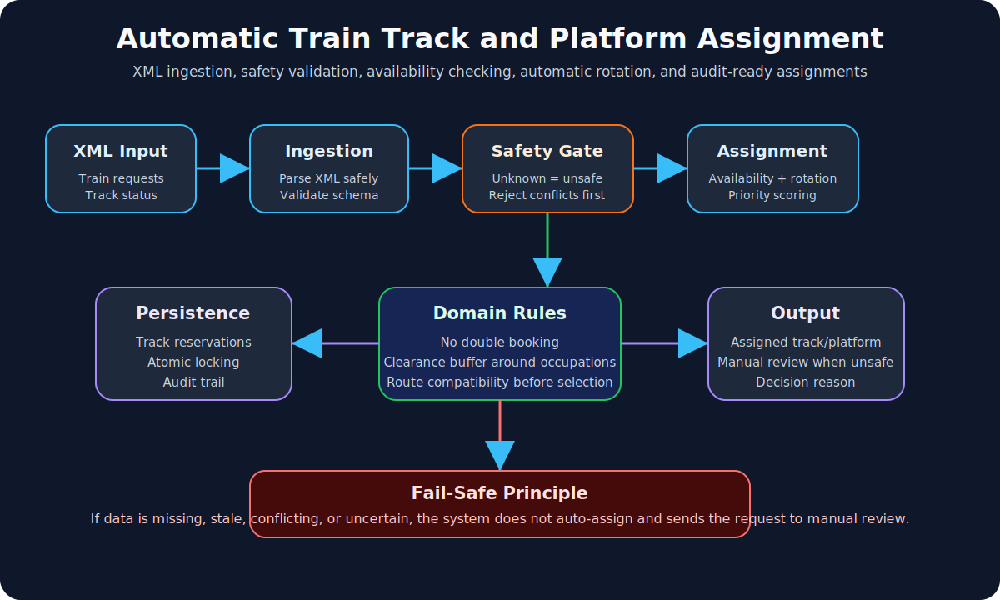

# Automatic Train Track and Platform Assignment

Java 25 / Spring Boot project for automatic XML-based train track and platform assignment.

The system receives a train request, checks track safety and availability, rotates assignment across safe tracks, records the decision, and shows the result on an interactive localhost dashboard.



## Project purpose

This project solves a common railway platform/track assignment problem:

> When multiple trains request tracks, the system should automatically choose a safe available track and avoid unsafe or occupied tracks.

This is an academic decision-support prototype. It is not certified railway signalling or vital interlocking software.

## Key features

- Accepts XML train assignment requests.
- Also supports JSON requests for API testing.
- Parses train request time windows.
- Parses tracks, operational status, and current occupations.
- Rejects closed, maintenance, unknown, or unsafe tracks.
- Skips tracks occupied during the requested time interval.
- Rotates assignment after the last assigned track.
- Returns either an assigned track or a manual-review reason.
- Records assignment decisions in the `assignment_audit` database table.
- Provides an interactive browser dashboard at `http://localhost:8080`.
- Includes unit, integration, E2E, and CI/CD automation.

## Professor demo workflow

Simple explanation for demo:

```text
XML train request
      -> AssignmentController
      -> XmlAssignmentRequestParser
      -> AssignmentService
      -> TrackAssignmentEngine
      -> safety rules and rotation
      -> AssignmentDecision
      -> assignment_audit table
      -> dashboard result
```

Short explanation:

> A train request is sent in XML. The backend parses the XML, checks every track, rejects unsafe or occupied tracks, applies rotation, assigns a safe track if available, records the decision, and displays the result on the dashboard.

## Main classes professors may ask about

| Class | Location | Role |
|---|---|---|
| `AutomaticTrainAssignmentApplication` | root package | Starts the Spring Boot application. |
| `AssignmentController` | `adapter/web` | Receives XML/JSON requests at `/api/assignments` and returns assignment results. |
| `XmlAssignmentRequestParser` | `adapter/xml` | Converts XML request data into Java domain objects. |
| `AssignmentService` | `application/assignment` | Coordinates assignment logic and audit saving. |
| `TrackAssignmentEngine` | `domain/service/assignment` | Main business logic for safe track selection and rotation. |
| `TrackOperationalStatusRule` | `domain/rule/track` | Rejects `CLOSED`, `UNDER_MAINTENANCE`, and `UNKNOWN` tracks. |
| `TrackAvailabilityRule` | `domain/rule/track` | Rejects tracks that overlap with existing occupations. |
| `TimeIntervalOverlapRule` | `domain/rule/time` | Checks if two time intervals conflict. |
| `TimeIntervalClearanceRule` | `domain/rule/time` | Adds a safety buffer around occupied intervals. |
| `AssignmentDecision` | `domain/model/assignment` | Represents the final result: assigned track or manual review. |
| `Track` | `domain/model/track` | Represents track id, status, and protected occupations. |
| `JdbcAssignmentAuditRepository` | `adapter/persistence` | Stores assignment decisions in PostgreSQL. |
| `src/main/resources/static/index.html` | resources | Interactive localhost dashboard. |

## Dashboard behavior

Open this page after starting the application:

```text
http://localhost:8080
```

The dashboard can:

- run XML assignment simulations;
- choose 10, 20, or 30 train requests;
- change train start time, duration, and spacing;
- change track status interactively;
- run preset scenarios such as rush hour or maintenance disruption;
- show the generated XML request;
- show the API response;
- show assignment results in a table;
- show a timeline of assigned trains.

## Requirements

- JDK 25
- Maven 3.9+
- Docker or compatible container runtime for PostgreSQL integration tests

Check versions:

```text
java -version
mvn -version
```

## Run the application locally

Start PostgreSQL:

```text
docker compose up -d postgres
```

Start the Spring Boot application:

```text
mvn spring-boot:run
```

Then open:

```text
http://localhost:8080
```

Health check:

```text
http://localhost:8080/actuator/health
```

Expected health result:

```json
{"groups":["liveness","readiness"],"status":"UP"}
```

## XML input format

Example file:

```text
src/main/resources/examples/assignment-request.xml
```

Example XML:

```xml
<assignmentRequest id="REQ-XML-1"
                   start="2026-08-05T10:00:00Z"
                   end="2026-08-05T10:20:00Z"
                   lastAssignedTrackId="T1">
  <tracks>
    <track id="T1" status="OPEN">
      <occupation start="2026-08-05T09:00:00Z" end="2026-08-05T09:30:00Z"/>
    </track>
    <track id="T2" status="OPEN"/>
    <track id="T3" status="CLOSED"/>
  </tracks>
</assignmentRequest>
```

## Submit XML request from CMD

Open a second CMD window while the app is running:

```text
curl -X POST http://localhost:8080/api/assignments ^
  -H "Content-Type: application/xml" ^
  -H "Accept: application/json" ^
  --data-binary @src/main/resources/examples/assignment-request.xml
```

Expected response:

```json
{
  "outcome": "ASSIGNED",
  "assignedTrackId": "T2",
  "reasons": ["SAFE_TRACK_ASSIGNED"]
}
```

## Submit JSON request from CMD

```text
curl -X POST http://localhost:8080/api/assignments ^
  -H "Content-Type: application/json" ^
  -d "{\"requestId\":\"REQ-1\",\"start\":\"2026-08-05T10:00:00Z\",\"end\":\"2026-08-05T10:20:00Z\",\"lastAssignedTrackId\":\"T1\",\"tracks\":[{\"id\":\"T1\",\"status\":\"OPEN\",\"occupations\":[]},{\"id\":\"T2\",\"status\":\"OPEN\",\"occupations\":[]}]}"
```

## Package structure

```text
com.interlocking.assignment
  domain        pure business rules and models
  application   use-case orchestration
  adapter       XML, HTTP, persistence, and dashboard adapters
```

Important rule:

```text
Domain logic must not depend on Spring, XML, PostgreSQL, HTTP, or JavaFX.
```

## Implemented architecture

```text
XML / JSON request
      -> AssignmentController
      -> AssignmentService
      -> TrackAssignmentEngine
      -> safety rules
           - operational status
           - time overlap
           - track availability
           - rotation after safety
      -> AssignmentDecision
      -> assignment_audit table
```

## Testing workflow

Tests are separated by scope:

```text
src/test/java  unit tests (*Test.java)
src/it/java    integration tests (*IT.java)
src/e2e/java   end-to-end tests (*E2E.java)
```

Run all main checks:

```text
mvn test
mvn verify -Pintegration
mvn verify -Pe2e
```

What each phase proves:

| Test type | Command | Purpose |
|---|---|---|
| Unit tests | `mvn test` | Checks individual rules and assignment logic. |
| Integration tests | `mvn verify -Pintegration` | Checks XML assignment flow. |
| E2E tests | `mvn verify -Pe2e` | Checks API request-to-response behavior. |

## CI/CD workflow

GitHub Actions runs automatically on push and pull request.

CI/CD stages:

```text
Push code to GitHub
      -> Fast unit checks
      -> XML integration checks
      -> API end-to-end checks
      -> Package Spring Boot JAR
      -> Upload test reports and artifact
```

Workflow file:

```text
.github/workflows/ci.yml
```

Artifacts produced by CI/CD:

- unit test reports;
- integration test reports;
- E2E test reports;
- packaged Spring Boot JAR.

## Completed implementation sequence

1. Added interval-overlap tests and implementation.
2. Added clearance buffer logic.
3. Added track availability and operational-status safety rules.
4. Added assignment engine with safe-track selection and rotation.
5. Added XML parser for automatic request ingestion.
6. Added REST API for XML and JSON assignment requests.
7. Added interactive localhost dashboard.
8. Added audit persistence table and JDBC repository.
9. Added separated unit, integration, and E2E test phases.
10. Added GitHub Actions CI/CD automation.

## Safety features

- Prevent assigning occupied tracks or platforms.
- Reject closed, maintenance, unknown, or unsafe tracks.
- Reject conflicting train routes before scoring or rotation.
- Apply clearance buffers around occupied time intervals.
- Send unsafe or uncertain requests to manual review.
- Keep priority/scoring below safety; priority must never override safety.
- Record assignment and rejection reasons for audit evidence.

## Previous project vs this project

| Previous layout visualizer | Current train assignment system |
|---|---|
| Mainly shows layout visually. | Makes automatic assignment decisions. |
| Focuses on display. | Focuses on XML input, backend rules, safety checks, and audit. |
| Usually static/demo data. | Dynamic request processing through API and dashboard. |
| Mostly visual validation. | Unit, integration, E2E, and CI/CD validation. |

Short difference:

```text
Layout visualizer = shows information visually.
Train assignment system = makes safe assignment decisions.
```

## Important note

This project demonstrates software design, XML ingestion, backend assignment logic, testing, and CI/CD automation for academic purposes. It is not certified railway signalling software.